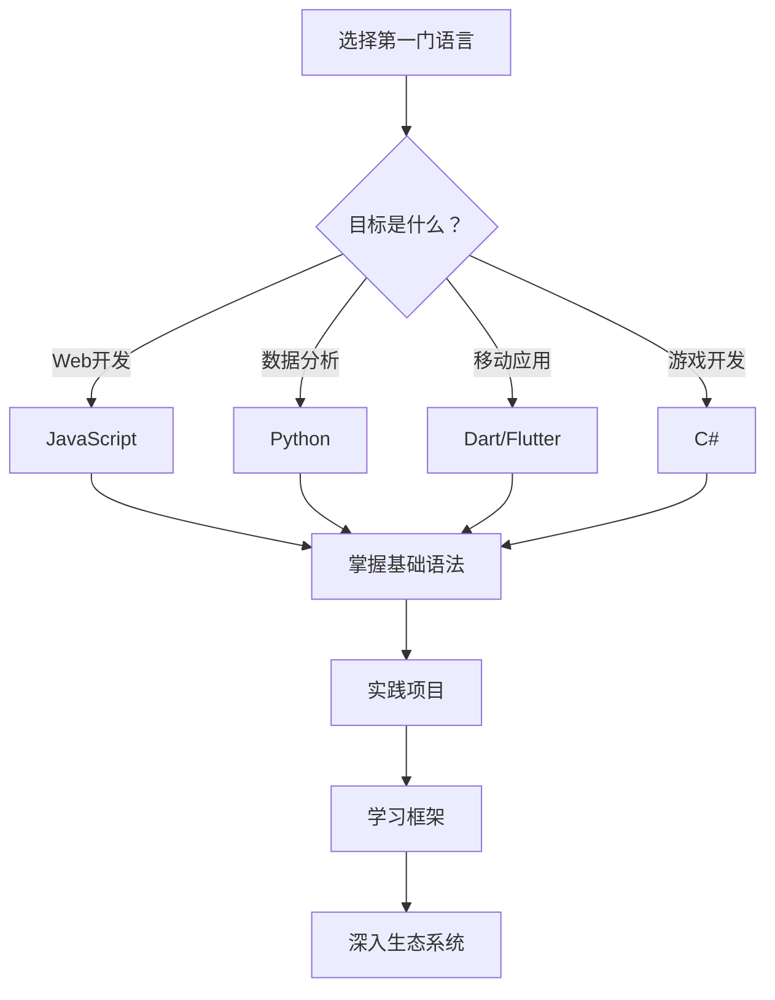

# 💻 编程语言大比拼：选择最适合你的那一个


> "选择编程语言就像选择工具，没有最好的，只有最合适的。" —— 编程哲学

## 📊 语言概览对比

### 🏆 流行度排行榜

| 排名 | 语言 | 2024年占比 | 趋势 | 主要用途 |
|------|------|------------|------|----------|
| 🥇 | **JavaScript** | 65.36% | 📈 | Web开发、全栈 |
| 🥈 | **Python** | 48.07% | 📈 | AI/ML、数据科学 |
| 🥉 | **TypeScript** | 38.87% | 📈 | 大型Web应用 |
| 4️⃣ | **Java** | 30.55% | 📉 | 企业级应用 |
| 5️⃣ | **C#** | 27.62% | ➡️ | .NET生态 |
| 6️⃣ | **Go** | 13.24% | 📈 | 云原生、微服务 |
| 7️⃣ | **Rust** | 12.93% | 📈 | 系统编程 |

*数据来源: Stack Overflow Developer Survey 2024*

---

## 🔍 详细语言分析

### 🐍 Python - 简洁优雅的全能选手


#### 语言特性

```python
# Python 的简洁之美
def fibonacci(n):
    """计算斐波那契数列"""
    if n <= 1:
        return n
    return fibonacci(n-1) + fibonacci(n-2)

# 列表推导式
squares = [x**2 for x in range(10)]

# 装饰器
@timer
def slow_function():
    time.sleep(1)
    return "完成"
```

#### 优势与劣势

| ✅ 优势 | ❌ 劣势 |
|---------|---------|
| 语法简洁易学 | 执行速度较慢 |
| 生态系统丰富 | GIL限制多线程 |
| 数据科学首选 | 移动开发支持差 |
| 跨平台兼容 | 内存占用较高 |

#### 应用场景

- 🤖 **人工智能/机器学习**
  - TensorFlow, PyTorch
  - 数据分析: Pandas, NumPy
  - 可视化: Matplotlib, Seaborn

- 🌐 **Web开发**
  - Django: 全功能框架
  - Flask: 轻量级框架
  - FastAPI: 现代API框架

- 🔧 **自动化脚本**
  - 系统管理
  - 数据处理
  - 测试自动化

---

### ⚡ JavaScript - Web世界的王者


#### 语言特性

```javascript
// 现代 JavaScript ES6+
const fetchUserData = async (userId) => {
  try {
    const response = await fetch(`/api/users/${userId}`);
    const user = await response.json();
    return user;
  } catch (error) {
    console.error('获取用户数据失败:', error);
  }
};

// 解构赋值
const { name, age, ...rest } = user;

// 模板字符串
const greeting = `你好，${name}！你今年${age}岁。`;

// 高阶函数
const numbers = [1, 2, 3, 4, 5];
const doubled = numbers.map(n => n * 2);
const evens = numbers.filter(n => n % 2 === 0);
```

#### 生态系统

```
JavaScript 生态圈
├── 前端框架
│   ├── React ⚛️
│   ├── Vue.js 💚
│   └── Angular 🅰️
├── 后端运行时
│   ├── Node.js 🟢
│   ├── Deno 🦕
│   └── Bun ⚡
├── 构建工具
│   ├── Webpack 📦
│   ├── Vite ⚡
│   └── Rollup 🎲
└── 包管理器
    ├── npm 📦
    ├── yarn 🧶
    └── pnpm 🚀
```

#### 性能对比

```
JavaScript 引擎性能 (ops/sec)
V8 (Chrome):     ████████████████████ 100%
SpiderMonkey:    ██████████████████   90%
JavaScriptCore:  █████████████████    85%
Chakra:          ████████████████     80%
```

---

### 🚀 Go - 云原生时代的新星


#### 语言特性

```go
// Go 的并发模型
package main

import (
    "fmt"
    "sync"
    "time"
)

func worker(id int, jobs <-chan int, results chan<- int) {
    for j := range jobs {
        fmt.Printf("Worker %d 处理任务 %d\n", id, j)
        time.Sleep(time.Second)
        results <- j * 2
    }
}

func main() {
    jobs := make(chan int, 100)
    results := make(chan int, 100)
    
    // 启动3个worker
    for w := 1; w <= 3; w++ {
        go worker(w, jobs, results)
    }
    
    // 发送任务
    for j := 1; j <= 5; j++ {
        jobs <- j
    }
    close(jobs)
    
    // 收集结果
    for a := 1; a <= 5; a++ {
        <-results
    }
}
```

#### 性能基准测试

| 指标 | Go | Python | Node.js | Java |
|------|----|---------|---------|----- |
| **启动时间** | 🟢 10ms | 🔴 100ms | 🟡 50ms | 🔴 200ms |
| **内存占用** | 🟢 5MB | 🔴 25MB | 🟡 15MB | 🔴 50MB |
| **并发处理** | 🟢 优秀 | 🔴 一般 | 🟡 良好 | 🟢 优秀 |
| **编译速度** | 🟢 快速 | N/A | N/A | 🟡 中等 |

---

### 🦀 Rust - 系统编程的未来


#### 内存安全特性

```rust
// Rust 的所有权系统
fn main() {
    let s1 = String::from("hello");
    let s2 = s1; // s1 的所有权转移给 s2
    // println!("{}", s1); // 编译错误！s1 已失效
    
    let s3 = s2.clone(); // 显式克隆
    println!("{} {}", s2, s3); // 正常工作
}

// 借用和引用
fn calculate_length(s: &String) -> usize {
    s.len() // 借用，不获取所有权
}

// 可变借用
fn change(s: &mut String) {
    s.push_str(", world");
}

// 生命周期注解
fn longest<'a>(x: &'a str, y: &'a str) -> &'a str {
    if x.len() > y.len() {
        x
    } else {
        y
    }
}
```

#### 零成本抽象

> **Rust哲学**: "你不使用的功能不会影响性能"

```rust
// 迭代器链式调用 - 编译时优化为循环
let sum: i32 = (0..1_000_000)
    .filter(|x| x % 2 == 0)
    .map(|x| x * x)
    .sum();

// 等价于手写循环的性能
let mut sum = 0;
for i in 0..1_000_000 {
    if i % 2 == 0 {
        sum += i * i;
    }
}
```

---

## 🎯 选择指南

### 📋 决策矩阵

| 需求场景 | 推荐语言 | 理由 |
|----------|----------|------|
| **Web前端开发** | JavaScript/TypeScript | 唯一选择，生态完善 |
| **移动应用开发** | Dart (Flutter), Swift, Kotlin | 跨平台或原生性能 |
| **数据科学/AI** | Python | 库最丰富，社区最活跃 |
| **企业级后端** | Java, C# | 成熟稳定，工具链完善 |
| **云原生/微服务** | Go | 并发优秀，部署简单 |
| **系统编程** | Rust, C++ | 性能极致，内存安全 |
| **游戏开发** | C#, C++, Rust | 性能要求高 |
| **区块链开发** | Solidity, Rust, Go | 安全性和性能并重 |

### 🚀 学习路径建议

#### 🔰 初学者路径



#### 🎓 进阶学习建议

1. **第一年**: 专精一门语言
   - [ ] 掌握核心语法
   - [ ] 理解语言特性
   - [ ] 完成3-5个项目

2. **第二年**: 拓展技术栈
   - [ ] 学习相关框架
   - [ ] 了解最佳实践
   - [ ] 参与开源项目

3. **第三年**: 多语言发展
   - [ ] 学习第二门语言
   - [ ] 对比语言差异
   - [ ] 选择专业方向

---

## 📈 未来趋势预测

### 🔮 2025-2030年展望

#### 📊 增长趋势

```
语言增长预测 (2025-2030)
Rust:        ████████████████████████████████ +150%
Go:          ████████████████████████ +120%
TypeScript:  ████████████████████ +100%
Python:      ████████████████ +80%
JavaScript:  ████████████ +60%
Java:        ████████ +40%
```

#### 🌟 新兴领域

- **WebAssembly**: 让更多语言运行在浏览器
- **量子计算**: Q#, Qiskit 等专用语言
- **边缘计算**: 轻量级、低延迟语言需求增长
- **AI原生语言**: 专为机器学习优化的新语言

### 💡 选择建议

#### 🎯 短期策略 (1-2年)

- **稳妥选择**: JavaScript, Python
- **高增长**: TypeScript, Go
- **专业领域**: Rust (系统), Swift (iOS)

#### 🚀 长期投资 (3-5年)

- **持续学习**: 保持对新语言的敏感度
- **深度专精**: 在1-2个领域成为专家
- **跨界融合**: 了解多个语言的设计哲学

---

## 🎉 总结

### 🔑 关键要点

1. **没有银弹**: 每种语言都有其适用场景
2. **生态重要**: 语言本身只是起点，生态决定上限
3. **持续学习**: 技术发展迅速，保持学习心态
4. **实践为王**: 理论再多不如动手实践

### 💭 最后的思考

> "编程语言只是工具，重要的是解决问题的思维方式。掌握一门语言的精髓，比浅尝多门语言更有价值。"

选择编程语言时，考虑以下因素：

- 🎯 **个人目标**: 职业规划和兴趣方向
- 🏢 **市场需求**: 就业机会和薪资水平  
- 📚 **学习成本**: 时间投入和学习曲线
- 🌍 **社区支持**: 文档质量和社区活跃度

记住，最好的编程语言就是你能用它解决实际问题的那一个！

---

*📝 作者: 编程语言研究小组*  
*📅 最后更新: 2025-08-20*  
*🔗 相关文章: [Web开发框架对比](./web-frameworks.md) | [编程学习路线图](./learning-roadmap.md)*
